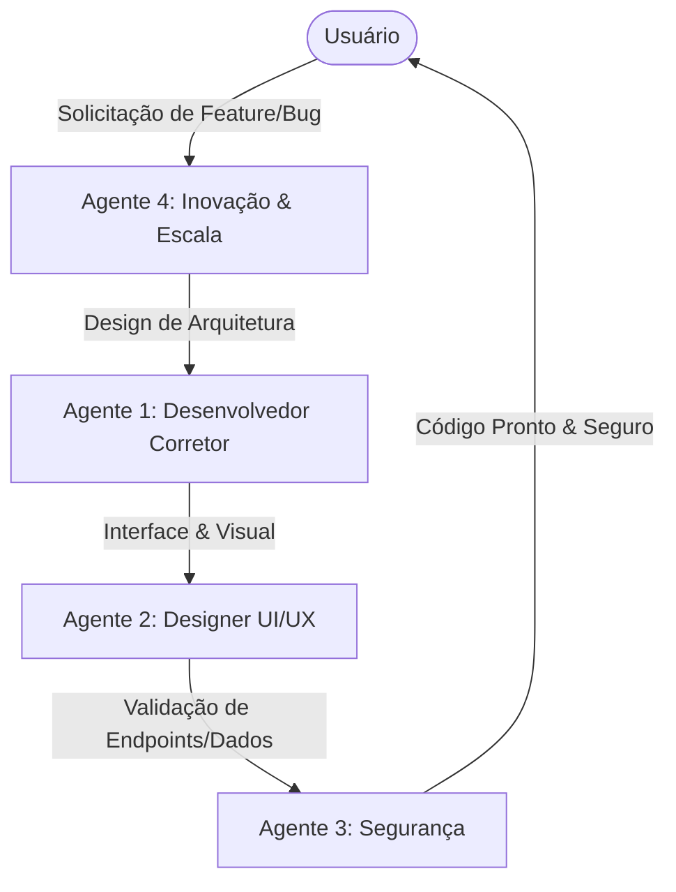

# 🤖 Equipe de Agentes Especialistas: Coleta App

Esta pasta contém as especificações, diretrizes de atuação e prompts de sistema dos 4 agentes de IA especializados que atuam colaborativamente no desenvolvimento e manutenção do **Coleta App**.

## Membros da Equipe

| Agente | Nome do Subagente | Especialidade Principal | Arquivo de Diretrizes |
| :--- | :--- | :--- | :--- |
| **Agente 1** | `desenvolvedor_corretor` | Qualidade de código, correção de bugs e refatoração | [desenvolvedor_corretor.md](./desenvolvedor_corretor.md) |
| **Agente 2** | `designer_ui_ux` | Layout premium, paletas de cores, tipografia, UI e UX | [designer_ui_ux.md](./designer_ui_ux.md) |
| **Agente 3** | `especialista_seguranca` | Blindagem de APIs, DevSecOps e proteção contra vazamento | [especialista_seguranca.md](./especialista_seguranca.md) |
| **Agente 4** | `arquiteto_inovacao` | Novas features, escalabilidade técnica e BullMQ | [arquiteto_inovacao.md](./arquiteto_inovacao.md) |

---

## Como Interagir com os Agentes

Os agentes foram devidamente registrados na engine do assistente de IA. Você pode direcionar tarefas específicas para cada um deles. Quando um bug funcional surgir, o **Agente 1** será o principal responsável. Quando for necessário polir a interface ou alterar cores, o **Agente 2** entrará em ação, e assim por diante.

### Fluxo de Desenvolvimento Colaborativo

Todos os códigos produzidos por esta equipe seguem estritamente as regras globais do projeto:
1. **Lógica em inglês** (variáveis, funções, comentários de código).
2. **Textos visíveis ao usuário final em português do Brasil (pt-BR)**.
